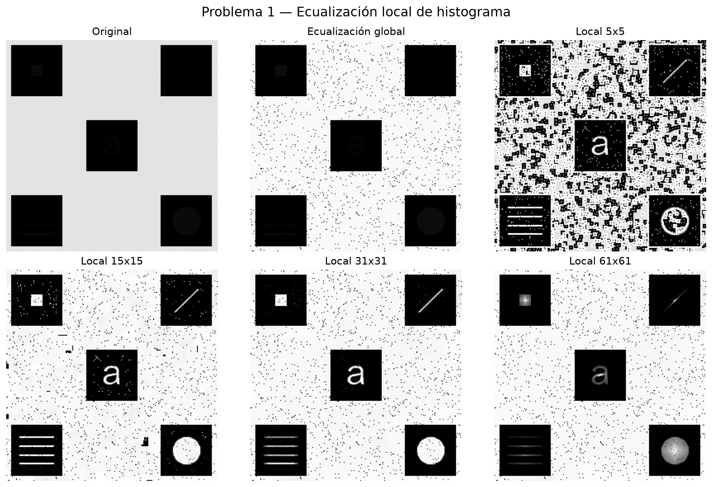

# Problema 1 — Ecualización local de histograma

## Comparación visual

La figura presenta la imagen original junto con los resultados de aplicar ecualización global y ecualización local de histograma. Para la técnica local se evaluaron ventanas de **5×5**, **15×15**, **31×31** y **61×61** píxeles.

## Método

Se procesó una imagen en escala de grises de 8 bits. Para cada píxel, la ecualización local calcula el histograma de intensidades de su vecindad y transforma el valor del píxel mediante la función de distribución acumulada (CDF) de esa ventana. En los bordes se replican los píxeles más cercanos, de manera equivalente a `cv2.BORDER_REPLICATE`.

Como referencia, la ecualización global utiliza un único histograma para toda la imagen. Por eso aplica la misma transformación de contraste a cada zona de la imagen.

## Análisis de resultados

La ecualización global aumenta el contraste general de la imagen, pero no puede adaptarse a las diferencias de iluminación o contraste entre regiones.

La ecualización local se adapta a cada vecindad y permite hacer más visibles detalles tenues. El tamaño de la ventana define el alcance de esa adaptación:

- **5×5:** realza detalles muy locales, aunque puede intensificar el ruido o producir cambios bruscos de contraste.
- **15×15:** mantiene una respuesta local marcada con un resultado más equilibrado.
- **31×31:** ofrece un compromiso entre la preservación de detalles locales y la estabilidad visual.
- **61×61:** genera una transformación más suave y estable, pero puede reducir el realce de detalles pequeños.

## Conclusión

La elección de la ventana depende de la escala de los detalles que se desean destacar y del nivel de ruido presente. Las ventanas pequeñas favorecen el detalle local; las grandes producen resultados más uniformes. La comparación visual permite elegir el compromiso más adecuado para la imagen analizada.
