## Problema 1: Ecualización local de histograma

### Descripción del problema

La ecualización de histograma redistribuye los niveles de gris de una imagen para aprovechar todo el rango, a partir del histograma de la imagen completa. Cuando una imagen tiene zonas cuyos detalles tienen una intensidad muy parecida a la de su entorno, esa ecualización global no alcanza: al usar todos los píxeles de la imagen, pierde la información local.

La ecualización local resuelve este problema. Desplaza una ventana de M×N píxeles a lo largo de la imagen, ecualiza el histograma de cada ventana y usa esa transformación solo para el píxel central. La consigna pide:

- **a)** Una función que implemente la ecualización local y reciba la imagen y el tamaño de la ventana.
- **b)** Aplicarla a `Imagen_con_detalles_escondidos.tif` para encontrar sus detalles ocultos.
- **c)** Analizar cómo influye el tamaño de la ventana en el resultado.

La solución está en `src/problema1_ecualizacion_local.py`.

### Análisis de la imagen

La imagen tiene cinco recuadros oscuros sobre un fondo claro. Para entender por qué los detalles no se ven, el script muestra su tamaño y cuenta cuántos píxeles tiene cada nivel de gris con `np.unique(img, return_counts=True)`:

```text
Tamaño: (256, 256), tipo: uint8
Nivel 0: 16872 píxeles
Nivel 1: 500 píxeles
Nivel 2: 130 píxeles
Nivel 3: 51 píxeles
Nivel 4: 161 píxeles
Nivel 5: 170 píxeles
Nivel 6: 98 píxeles
Nivel 7: 27 píxeles
Nivel 8: 130 píxeles
Nivel 9: 48 píxeles
Nivel 10: 996 píxeles
Nivel 11: 37 píxeles
Nivel 226: 1175 píxeles
Nivel 227: 43946 píxeles
Nivel 228: 1195 píxeles
```

La imagen mide 256×256 píxeles y usa solo 15 de los 256 niveles posibles. El histograma de la Figura 1 muestra que esos niveles están agrupados en los dos extremos del rango:

- **Niveles 0 a 11:** los recuadros oscuros y lo que hay dentro de ellos.
- **Niveles 226 a 228:** el fondo claro, que vale 227 en casi todos sus píxeles.

Lo que hay dentro de un recuadro se diferencia del negro en 11 niveles como máximo, y por eso no se distingue a simple vista.

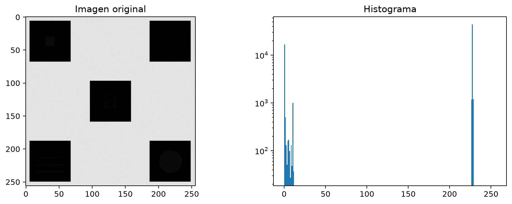

### Ecualización global

Como referencia, se aplicó `cv2.equalizeHist` a la imagen completa. Como usa un único histograma, aplica la misma transformación en todas las zonas. El script muestra a qué nivel lleva cada nivel original:

```text
Nivel 0 -> 0
Nivel 1 -> 3
Nivel 2 -> 3
Nivel 3 -> 4
Nivel 4 -> 4
Nivel 5 -> 5
Nivel 6 -> 6
Nivel 7 -> 6
Nivel 8 -> 7
Nivel 9 -> 7
Nivel 10 -> 12
Nivel 11 -> 12
Nivel 226 -> 18
Nivel 227 -> 249
Nivel 228 -> 255
```

La Figura 2 muestra la imagen ecualizada y su histograma. La salida explica el resultado:

- **Los recuadros siguen sin mostrar detalles.** El nivel 0 es el mínimo y va a 0. Según la salida de la sección anterior, los niveles 1 a 11 suman 2 348 píxeles, menos del 5 % de los que no valen 0, así que la ecualización les asigna menos del 5 % del rango: quedan entre 3 y 12, todavía casi negros.
- **El fondo se llena de puntos.** El nivel 226 va a 18 y el 227 a 249. Una diferencia de un solo nivel en el fondo se convierte en un salto de 231 niveles, y por eso el fondo queda salpicado de puntos oscuros.

La ecualización global, entonces, no revela los detalles: hace falta una transformación que se adapte a cada zona de la imagen.

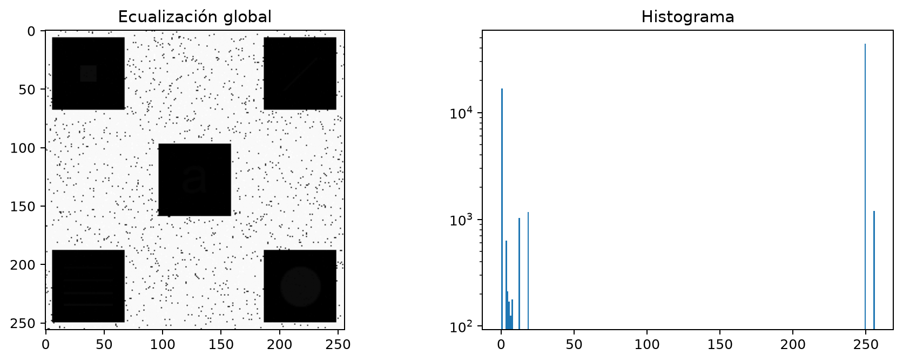

### Implementación de la ecualización local (ítem a)

La función `ecualizacion_local(img, ventana)` recibe la imagen y el tamaño de la ventana como una tupla `(M, N)`. Para cada píxel de la imagen:

1. Toma la ventana de M×N píxeles centrada en él.
2. Ecualiza el histograma de la ventana con `cv2.equalizeHist`.
3. Le asigna al píxel el nuevo nivel del centro de la ventana.

La transformación que aplica `cv2.equalizeHist` en el paso 2 es:

$$
s = \operatorname{round}\left( 255 \cdot \frac{\mathrm{CDF}(g) - \mathrm{CDF}_{\min}}{M \cdot N - \mathrm{CDF}_{\min}} \right)
$$

donde $g$ es el nivel del píxel central y $\mathrm{CDF}_{\min}$ es el primer valor no nulo de la distribución acumulada de la ventana.

**Bordes.** En los píxeles cercanos al borde, la ventana se sale de la imagen. Para resolverlo, antes de recorrerla se le agrega un marco con `cv2.copyMakeBorder` y `cv2.BORDER_REPLICATE`, que repite los píxeles extremos. El marco tiene la mitad de la ventana de cada lado; con una ventana par, un píxel menos abajo y a la derecha. Así, el recorte de M×N que empieza en la posición (fila, columna) de la imagen con borde queda centrado en el píxel (fila, columna) de la original. Para la ventana más grande, el script muestra:

```text
Tamaño con borde para una ventana de 61x61: (316, 316)
```

La Figura 3 compara la imagen original con la imagen con borde: se agregan 30 píxeles por lado. Sobre la imagen con borde se marcan con `cv2.rectangle`, en azul, los límites de la imagen original y, en rojo, la ventana de 61×61 de su primer píxel. Ese píxel, marcado con un punto, queda en el centro de la ventana, y solo el cuarto inferior derecho de la ventana cae dentro de la imagen original: el resto son píxeles del borde replicado.

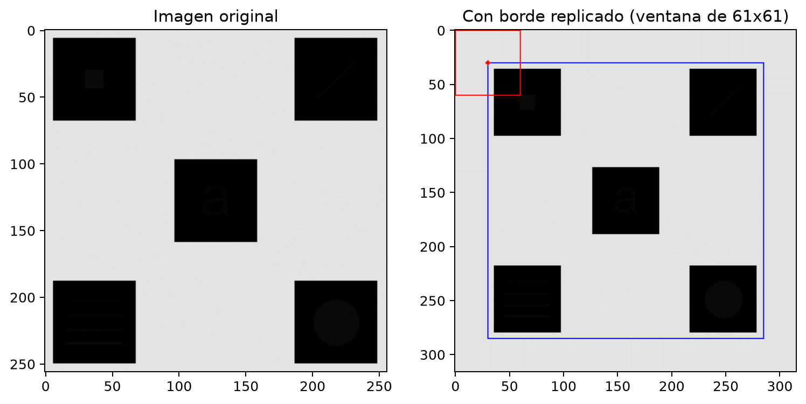

### Detalles ocultos (ítem b)

Se aplicó la función con ventanas de 5×5, 15×15, 31×31 y 61×61 píxeles. La Figura 4 compara los resultados con la imagen original y con la ecualización global. Con la ecualización local aparecen los cinco detalles ocultos, que se resumen en la tabla siguiente.

| Recuadro | Detalle oculto |
|:-------|:----------|
| Superior izquierdo | Un pequeño cuadrado claro |
| Superior derecho | Un segmento diagonal ascendente |
| Central | La letra minúscula «a» |
| Inferior izquierdo | Cuatro líneas horizontales paralelas |
| Inferior derecho | Un disco |

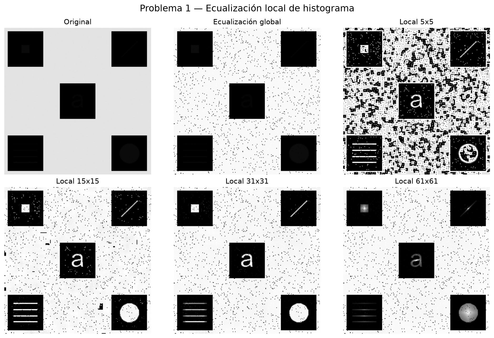

### Influencia del tamaño de la ventana (ítem c)

La tabla siguiente resume lo que se observa al comparar las ecualizaciones locales de la Figura 4.

| Ventana | Observación |
|:---|:---------------|
| 5×5 | Los detalles aparecen, pero el fondo queda granulado. En el fondo casi todos los píxeles valen 227; en una ventana de solo 25 píxeles, un único 226 o 228 alcanza para producir un salto de nivel muy grande. Además, el interior del disco queda con zonas oscuras. |
| 15×15 | Las figuras se distinguen con fuerza, pero todavía se amplifican puntos y pequeños bloques del fondo, y aparecen puntos blancos sueltos dentro de los recuadros. |
| 31×31 | Es el mejor compromiso para esta imagen: las cinco figuras se leen bien y el fondo es menos dominante que con 5×5 o 15×15. |
| 61×61 | Las figuras se ven más apagadas y con degradados: el disco, por ejemplo, es más claro en el centro que en el borde. |

**Por qué aparecen degradados con 61×61.** En los ejes de la Figura 1 se ve que cada recuadro mide unos 60 píxeles de lado: la ventana de 61×61 es casi del tamaño de un recuadro. Por eso, en casi cualquier punto de un recuadro, la ventana incluye también parte del fondo claro. Esos píxeles quedan por encima de los detalles en la distribución acumulada, así que el detalle deja de ser el nivel más alto de la ventana y se lleva a un valor más bajo. Cuánto fondo entra depende de la posición: en el centro del recuadro entra menos y el detalle se ve más claro; cerca del borde entra más y se oscurece.

**La ventana de 31×31.** La Figura 5 muestra el resultado con la ventana elegida y su histograma, en el mismo formato que la Figura 2 para poder compararlos. La ecualización global asigna un único nivel de salida a cada nivel original, así que su histograma tiene solo barras aisladas: según la salida de la sección 1.3, apenas 10 valores distintos (0, 3, 4, 5, 6, 7, 12, 18, 249 y 255). En la ecualización local, en cambio, la transformación depende de la vecindad de cada píxel: un mismo nivel original puede terminar en valores distintos, y el histograma ocupa prácticamente todo el rango entre 0 y 255. Por eso los detalles, que en la imagen original diferían del negro en pocos niveles, quedan claros sobre sus recuadros.

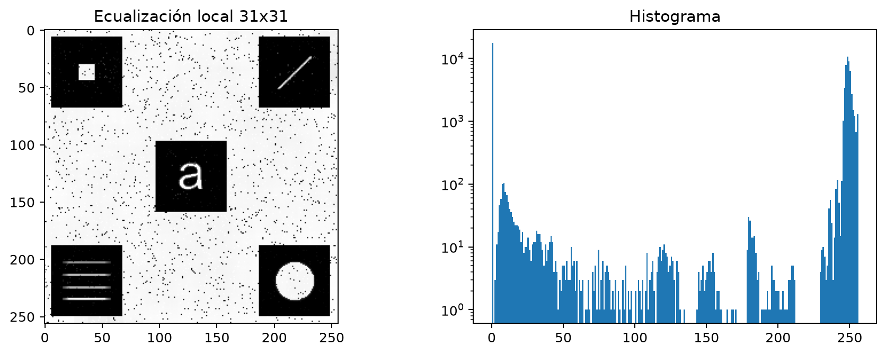

### Conclusiones

La ecualización global no revela los detalles porque reparte el rango según la cantidad de píxeles de toda la imagen, y los niveles de los detalles tienen muy pocos píxeles. La ecualización local, en cambio, calcula la transformación con la vecindad de cada píxel y estira los pocos niveles de cada recuadro a todo el rango.

El tamaño de la ventana tiene que cumplir dos condiciones:

- **Incluir píxeles más oscuros que el detalle**, como los del recuadro que lo rodea. Si la ventana cae entera dentro del detalle, el nivel del detalle es el más bajo de la ventana y la fórmula de la sección 1.4 lo lleva a 0, o lo deja igual, si la ventana tiene un solo nivel: por eso con 5×5 el disco queda con zonas oscuras (Figura 4). No hace falta que la ventana sea más grande que el detalle: con 15×15 el disco, que es más grande, se ve completo.
- **Ser menor que los recuadros**, para no mezclarlos con el fondo claro.

En esta imagen, con recuadros de unos 60 píxeles de lado, la ventana de 31×31 cumple las dos condiciones: las ventanas más chicas amplifican el ruido del fondo, y la de 5×5 deja además zonas oscuras dentro del disco; la de 61×61 mezcla cada recuadro con el fondo.

## Problema 2: Validación de planillas de calificaciones

### Descripción del problema

Cada planilla tiene una tabla de 20 registros. Cada registro tiene seis campos: Legajo, Nombre y Apellido, tres notas parciales y la Condición Final. El objetivo es verificar automáticamente, a partir de la imagen de la planilla, que cada campo cumpla las restricciones de la consigna:

- **Legajo:** 8 caracteres, formando una única palabra.
- **Nombre y Apellido:** al menos dos palabras y no más de 12 caracteres.
- **Parcial 1, 2 y 3:** 1 o 2 caracteres consecutivos.
- **Condición Final:** un único carácter.

La consigna pide:

- **a)** Mostrar por pantalla si cada campo de cada registro es correcto (OK) o incorrecto (MAL).
- **b)** Generar una imagen con los alumnos no aprobados (condición L o R) cuyos registros son correctos, con el *crop* del nombre y un indicador que distinga L de R.
- **c)** Generar un archivo CSV con el resultado de la validación de cada registro.
- **d)** Aplicar el algoritmo, en ciclo, a las cuatro planillas e informar los resultados.

La solución está en `src/problema2_validacion_planillas.py`. El script primero muestra el detalle de cada paso con la planilla `grade_sheet_1.png` (la Figura 9 usa una celda de `grade_sheet_4.png`), y después procesa las cuatro planillas en un ciclo.

El script se organiza en una función por paso: `detectar_grilla` encuentra las líneas de la tabla, `recortar_celda` recorta cada campo, `componentes` y `analizar_campo` cuentan sus caracteres y espacios, `validar` aplica la restricción de la consigna, y `medir_letra` y `leer_condicion` leen la letra de la Condición Final. `validar_planilla` aplica esos pasos a una planilla y muestra el resultado (ítem a), `guardar_no_aprobados` genera la imagen del ítem b y `guardar_csv`, el CSV del ítem c.

### Binarización

Para separar la tinta del fondo, la imagen se binariza con `img_th = img < th`: los píxeles más oscuros que el umbral `th` se consideran tinta. El umbral se elige automáticamente en cada planilla con el método de Otsu (`cv2.threshold` con `cv2.THRESH_OTSU`). El script lo muestra por pantalla al comienzo de cada planilla:

```text
=== Planilla grade_sheet_1.png ===
Umbral de Otsu: 134
=== Planilla grade_sheet_2.png ===
Umbral de Otsu: 135
=== Planilla grade_sheet_3.png ===
Umbral de Otsu: 134
=== Planilla grade_sheet_4.png ===
Umbral de Otsu: 143
```

La Figura 6 muestra la primera planilla y su versión binarizada, con la tinta en negro.

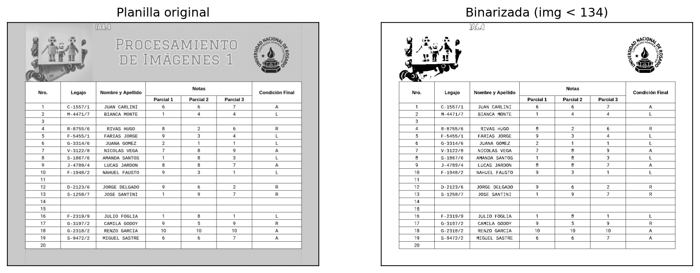

### Detección de la grilla

Para encontrar las celdas se detectan las líneas de la tabla, como sugiere la consigna: se suma la cantidad de píxeles oscuros de cada fila (`img_rows = np.sum(img_th, 1)`) y de cada columna (`img_cols = np.sum(img_th, 0)`). Las líneas de la tabla cruzan casi toda la imagen, así que en esas sumas aparecen como picos mucho más altos que los de las filas o columnas con texto.

Las filas y columnas que forman parte de una línea se marcan con un umbral para cada dirección, como propone la consigna: `img_rows_th = img_rows > th_row` e `img_cols_th = img_cols > th_col`, donde `th_row` es la mitad del ancho de la imagen y `th_col`, la mitad del alto. En la Figura 7, esos umbrales son la línea roja discontinua: los picos de las líneas los superan, y las filas y columnas con texto quedan muy por debajo.

Como advierte la consigna, una línea puede tener más de un píxel de grosor, y entonces ocupa varias posiciones seguidas en `img_rows_th`. Por eso se busca el inicio y el fin de cada línea con el método del ejemplo de los renglones de la Unidad 1: `np.diff(img_rows_th)` vale True donde `img_rows_th` cambia de valor, y `np.argwhere` devuelve esas posiciones, que alternan entre el píxel anterior al inicio de una línea y su fin. Sumando 1 a las posiciones pares y agrupándolas de a dos con `np.reshape`, cada línea queda como un par (inicio, fin). Por ejemplo, para `[False, False, True, True, True, False, False]` los cambios están en las posiciones 1 y 4, y el resultado es `[[2, 4]]`: un tramo que empieza en la posición 2 y termina en la 4. Esto lo hace la función `inicio_fin`. Después, el script verifica que haya 22 líneas horizontales y 8 verticales. En la primera planilla encuentra:

```text
Líneas detectadas: 22 horizontales y 8 verticales
Primeras líneas horizontales [inicio, fin]: [[210, 210], [286, 286], [312, 312]]
Primeras líneas verticales [inicio, fin]: [[63, 63], [189, 189], [315, 315]]
```

Son las 22 líneas horizontales que delimitan el encabezado y los 20 registros, y las 8 verticales que delimitan las 7 columnas. En estas planillas las líneas miden 1 píxel, así que en cada par el inicio y el fin coinciden; una línea más gruesa daría un par distinto, pero se contaría igual una sola vez. Como los umbrales son una fracción del tamaño de la imagen, la detección tampoco depende de la escala ni de la posición de la tabla: la cuarta planilla, que tiene otro tamaño, se procesa igual.

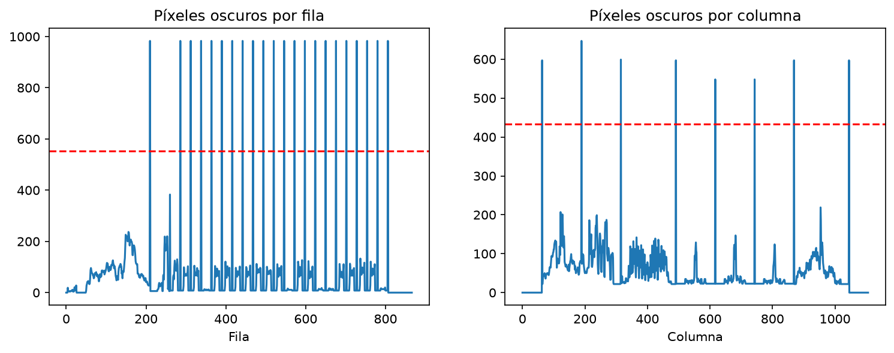

La Figura 8 muestra las líneas detectadas sobre la planilla: en rojo las horizontales y en azul las verticales.

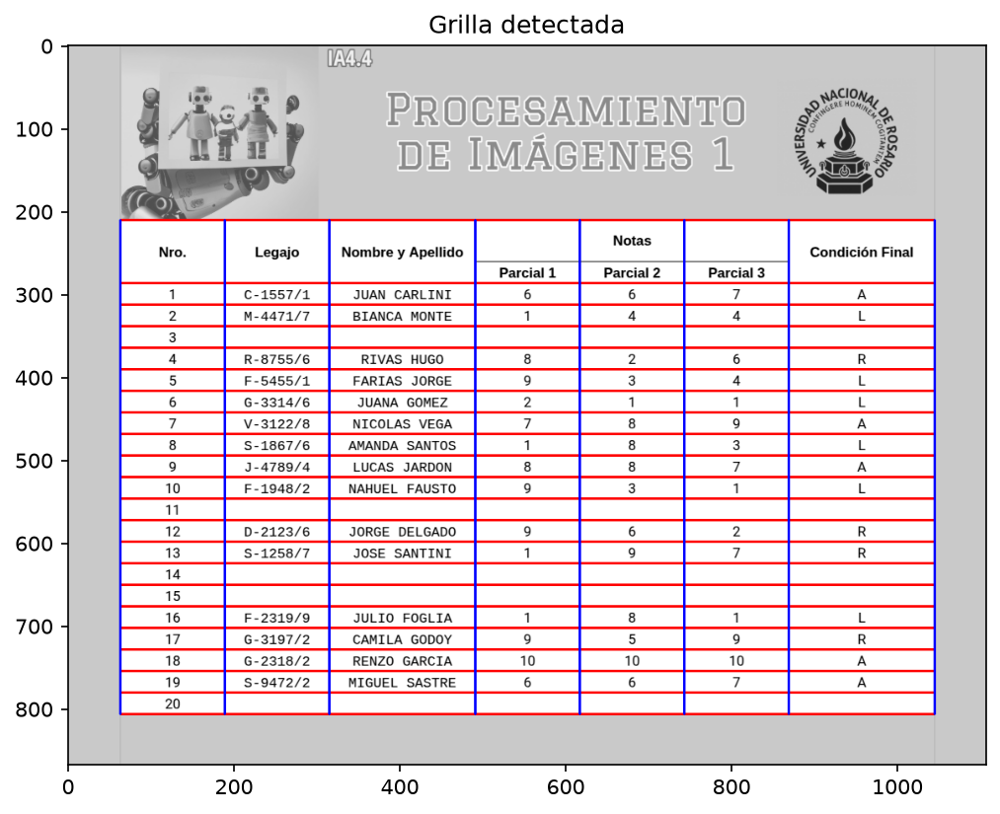

### Caracteres y palabras de cada campo

Cada campo se recorta entre las líneas detectadas con la función `recortar_celda`: desde el píxel siguiente al fin de una línea hasta el anterior al inicio de la siguiente. Por ejemplo, el Legajo del registro 1 está entre las líneas horizontales 286 y 312 y las verticales 189 y 315 (la segunda y la tercera de cada salida de la sección 2.3), así que se recortan las filas 287 a 311 y las columnas 190 a 314: una celda de 25 × 125 píxeles. Así el recorte no incluye ningún píxel de las líneas, cualquiera sea su grosor. En cada recorte se buscan las componentes conectadas con `cv2.connectedComponentsWithStats` (conectividad 8), y se aplican tres reglas:

1. **Se descartan las componentes de 1 píxel**, con el filtro por área que sugiere la consigna: `ix_area = stats[:, -1] > th_area` y `stats = stats[ix_area, :]`, con `th_area = 1`. Así se eliminan restos de las líneas o píxeles sueltos. Se usa el valor más bajo posible para no perder marcas pequeñas: el punto de «1.0», en el Parcial 2 del registro 15 de `grade_sheet_3.png`, mide 2 píxeles y cuenta como carácter, y por eso ese campo queda MAL. En estas cuatro planillas, con el umbral de Otsu y el recorte entre líneas, no aparece ninguna componente de 1 píxel, así que el filtro no descarta ninguna; se mantiene como protección.
2. **Las componentes que se superponen en horizontal forman un solo carácter.** La Ñ está entre los caracteres permitidos y su tilde es una componente separada de la letra; sin esta regla contaría como dos caracteres.
3. **Una separación mayor a 0,6 veces la altura del carácter más alto de la celda es un espacio**, es decir, un cambio de palabra. En las cuatro planillas, entre las letras de una palabra la separación es como mucho 0,36 veces esa altura (4 píxeles con letras de 11), y entre palabras es al menos 0,86 veces. El límite se expresa en proporción a la altura, y no en píxeles, para que no dependa de la escala de la planilla.

Como ejemplo, el script muestra las componentes de la celda Legajo del registro 1, que vale «C-1557/1». Cada fila es una componente, con su posición (x, y), su ancho, su alto y su área en píxeles; la última columna no la muestra el script, sino que indica a qué carácter corresponde:

| x | y | Ancho | Alto | Área | Carácter |
|:--|:--|:--|:--|:--|:--|
| 84 | 7 | 7 | 12 | 19 | / |
| 23 | 8 | 9 | 11 | 33 | C |
| 44 | 8 | 8 | 11 | 31 | 1 |
| 54 | 8 | 8 | 11 | 39 | 5 |
| 64 | 8 | 8 | 11 | 39 | 5 |
| 74 | 8 | 7 | 11 | 23 | 7 |
| 94 | 8 | 8 | 11 | 31 | 1 |
| 35 | 14 | 5 | 1 | 5 | - |

Las componentes no salen de izquierda a derecha: OpenCV las numera en el orden en que las encuentra al recorrer la celda de arriba hacia abajo, y por eso la «/», que empieza más arriba, es la primera, y el «-», la última. Por eso `analizar_campo` las ordena por su posición horizontal antes de contar. Ninguna se superpone con otra, y la separación más grande entre dos seguidas es de 4 píxeles, menor que el límite de 0,6 × 12 = 7,2 píxeles (12 es el alto de la «/»): el legajo tiene 8 caracteres y ningún espacio. En el nombre del mismo registro, «JUAN CARLINI», hay una separación mayor al límite. El script lo muestra así:

```text
Legajo del registro 1: caracteres = 8, espacios = 0
Nombre y Apellido del registro 1: caracteres = 11, espacios = 1
```

La parte más sensible es la binarización. La Figura 9 muestra el Parcial 1 del registro 2 de `grade_sheet_4.png`, que vale «100» y, por lo tanto, es incorrecto. Con un umbral fijo de 160, que fue el primero que se probó, entran los grises del borde de los dígitos y los dos ceros quedan unidos en una sola componente: el campo cuenta 2 caracteres y queda OK. Con el umbral de Otsu, que en esta planilla vale 143, cada dígito es una componente y el campo queda MAL.

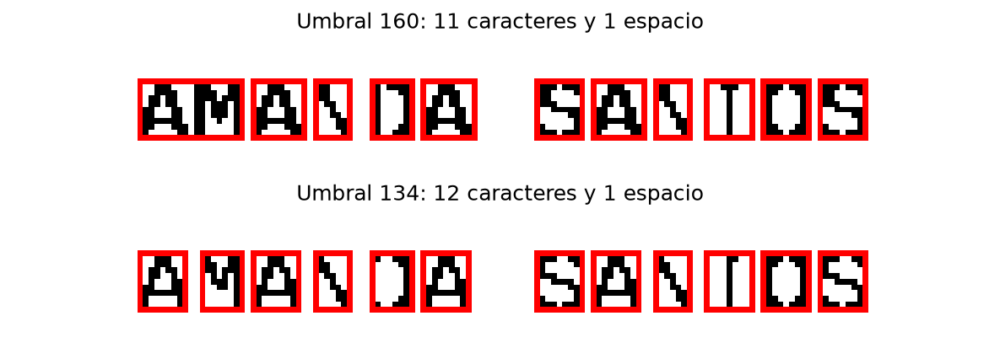

### Validación de los campos (ítem a)

Con la cantidad de caracteres y de espacios de cada campo, se aplican estos criterios:

| Campo | Restricción de la consigna | Criterio implementado |
|:----|:------|:------|
| Legajo | 8 caracteres, una única palabra | 8 caracteres y ningún espacio |
| Nombre y Apellido | Al menos dos palabras y no más de 12 caracteres | Al menos un espacio y no más de 12 caracteres |
| Parcial 1, 2 y 3 | 1 o 2 caracteres consecutivos | 1 o 2 caracteres y ningún espacio |
| Condición Final | Un único carácter | Exactamente 1 carácter |

Los espacios no se cuentan entre los 12 caracteres del nombre, porque no están entre los caracteres permitidos que enumera la consigna. Por ejemplo, «AMANDA SANTOS» tiene 12 letras y es correcto. Una celda vacía no tiene caracteres, así que no cumple ningún criterio y queda MAL.

Para ver cómo se pasa de los conteos a OK o MAL, el script muestra un registro con campos correctos e incorrectos, el 19 de `grade_sheet_2.png`:

```text
Registro 19 de grade_sheet_2:
Legajo: caracteres = 9, espacios = 1 -> MAL
Nombre y Apellido: caracteres = 12, espacios = 1 -> OK
Parcial 1: caracteres = 1, espacios = 0 -> OK
Parcial 2: caracteres = 1, espacios = 0 -> OK
Parcial 3: caracteres = 3, espacios = 0 -> MAL
Condición Final: caracteres = 1, espacios = 0 -> OK
```

El legajo, «S-94722/ 1», tiene 9 caracteres y un espacio, y el Parcial 3, «100», tiene 3 caracteres: los dos quedan MAL. El nombre, «MIGUEL SASTRE», tiene 12 caracteres y un espacio, así que cumple.

Por cada registro, el script muestra el resultado de cada campo con el formato de la consigna:

```text
Registro 1:
Legajo: OK
Nombre y Apellido: OK
Parcial 1: OK
Parcial 2: OK
Parcial 3: OK
Condición Final: OK
```

### Alumnos no aprobados (ítem b)

Para los registros con todos los campos correctos, la función `leer_condicion` lee la letra de la Condición Final a partir de su forma, como muestra la Figura 10:

- La **L** y la **R** tienen un trazo vertical a la izquierda de toda su altura: la primera columna de la letra tiene tinta en todas sus filas. En la **A**, la primera columna tiene tinta en menos de la mitad de las filas.
- Entre la L y la R, solo la **R** tiene tinta en su mitad superior derecha.

La función `medir_letra` calcula esas dos medidas: `tinta_columna_izquierda`, la fracción de las filas de la letra con tinta en su primera columna, y `tinta_arriba_derecha`, si hay tinta en la mitad derecha de su mitad de arriba. El script las muestra para las letras de la Figura 10:

```text
Registro 1: tinta_columna_izquierda = 0.08, tinta_arriba_derecha = True -> A
Registro 2: tinta_columna_izquierda = 1.00, tinta_arriba_derecha = False -> L
Registro 4: tinta_columna_izquierda = 1.00, tinta_arriba_derecha = True -> R
```

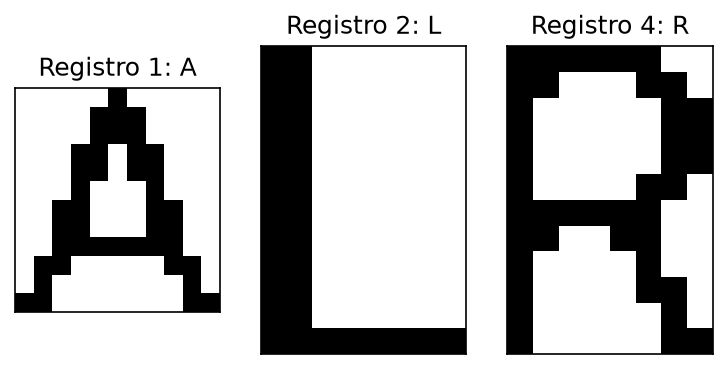

Con los alumnos con condición L o R, la función `guardar_no_aprobados` arma una imagen por planilla, con el *crop* del campo Nombre y Apellido de cada uno, en dos columnas: a la izquierda los libres y a la derecha los que recuperan. El título de cada columna funciona como indicador e incluye la cantidad de alumnos, así que una columna vacía muestra «0 alumnos». La Figura 11 muestra la imagen de la primera planilla.

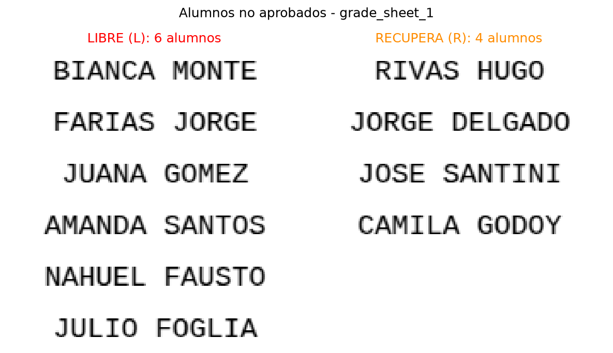

### Archivo CSV (ítem c)

Por cada planilla, la función `guardar_csv` guarda `validacion_grade_sheet_<id>.csv`, armado con pandas. Tiene una fila por registro, con el ID en la primera columna (el número de orden del registro en la planilla) y una columna por campo, en el orden de la consigna, con el valor OK o MAL. Por ejemplo, las primeras filas del CSV de la primera planilla son:

```text
ID,Legajo,Nombre y Apellido,Parcial 1,Parcial 2,Parcial 3,Condición Final
1,OK,OK,OK,OK,OK,OK
2,OK,OK,OK,OK,OK,OK
3,MAL,MAL,MAL,MAL,MAL,MAL
```

El registro 3 de esa planilla está vacío, y por eso todos sus campos quedan MAL.

### Resultados de las cuatro planillas (ítem d)

El algoritmo está en la función `validar_planilla(img)`, que recibe únicamente la imagen de una planilla, muestra por pantalla el resultado de cada campo de cada registro y devuelve esos resultados y los alumnos no aprobados. El ciclo del final del script la aplica a las cuatro planillas y, con lo que devuelve, `guardar_csv` y `guardar_no_aprobados` generan el CSV y la imagen de no aprobados de cada una. Al final de cada planilla, el script muestra un resumen; para la primera:

```text
Registros con todos los campos OK: 15, libres: 6, recuperan: 4
```

La tabla reúne el resumen de las cuatro planillas:

| Planilla | Registros con todos los campos OK | Libres (L) | Recuperan (R) |
|:----|:--------|:---|:---|
| `grade_sheet_1.png` | 15 | 6 | 4 |
| `grade_sheet_2.png` | 3 | 3 | 0 |
| `grade_sheet_3.png` | 0 | 0 | 0 |
| `grade_sheet_4.png` | 6 | 2 | 2 |

Las planillas incluyen campos pensados para poner a prueba la validación. La tabla siguiente muestra los más difíciles, qué cuenta el método en cada uno y el resultado que queda en el CSV:

| Contenido | Ubicación | Qué cuenta el método | Resultado |
|:----|:------|:------|:---|
| «1.0» | Planilla 3, registro 15, Parcial 2 | 3 caracteres: el punto mide 2 píxeles y no se descarta | MAL |
| «100» | Planilla 4, registro 2, Parcial 1 | 3 caracteres; con los ceros unidos serían 2 (Figura 9) | MAL |
| «S-94722/ 1» | Planilla 2, registro 19, Legajo | 9 caracteres y 1 espacio | MAL |
| «R-47 89/4» | Planilla 3, registro 9, Legajo | 8 caracteres, pero con 1 espacio: dos palabras | MAL |
| «AMANDASANTOS» | Planilla 3, registro 8, Nombre y Apellido | 12 caracteres y ningún espacio: una sola palabra | MAL |
| «JOSE LUCAS SANTINI» | Planilla 2, registro 13, Nombre y Apellido | 16 caracteres y 2 espacios | MAL |
| «JUAN CRUZ GAGO» | Planilla 3, registro 15, Nombre y Apellido | 12 caracteres y 2 espacios | OK |
| «LL» | Planillas 2, 3 y 4, registro 10, Condición Final | 2 caracteres | MAL |
| «Rec» | Planilla 2, registro 17, Condición Final | 3 caracteres | MAL |
| «AUS» | Planilla 2, registro 16, Parcial 1 | 3 caracteres | MAL |

Las Figuras 12, 13 y 14 muestran las imágenes de no aprobados de las otras tres planillas. En la tercera ningún registro está completo correctamente, así que su imagen muestra 0 alumnos en las dos columnas.

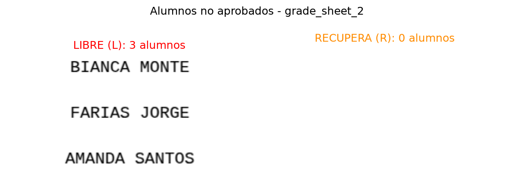


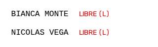

### Problemas encontrados

- **Caracteres unidos.** Con un umbral fijo de 160, los grises del borde de los caracteres unían caracteres vecinos (Figura 9), y el «100» de la cuarta planilla quedaba como correcto. Se resolvió eligiendo el umbral con el método de Otsu en cada planilla.
- **Líneas de más de un píxel.** Una línea gruesa ocupa varias filas o columnas seguidas en la proyección y se contaría más de una vez. Por eso se busca el inicio y el fin de cada línea (sección 2.3), y cada celda se recorta entre ellas.
- **Marcas pequeñas.** El punto de «1.0» es mucho más chico que una letra, y un filtro de área alto lo eliminaría: el campo se contaría como «10» y quedaría correcto. Por eso solo se descartan las componentes de 1 píxel, y ese campo queda MAL en el CSV de la tercera planilla.
- **La letra Ñ.** La consigna permite la Ñ, pero su tilde no toca a la letra, así que las componentes conectadas la separan en dos y el campo contaría un carácter de más. Por eso las componentes que se superponen en horizontal se cuentan como un solo carácter (sección 2.4). Ninguna de las cuatro planillas tiene una Ñ, así que esta regla no se pudo comprobar con los datos provistos.
- **Distinción entre A y R.** Las dos letras tienen un hueco cerrado en su parte superior (Figura 10), así que no alcanza con mirar si la letra tiene huecos. La diferencia está en el trazo vertical izquierdo, que la R tiene y la A no.

### Conclusiones

Las proyecciones de píxeles oscuros por fila y por columna permiten detectar la grilla sin depender de la escala, de la posición de la tabla ni del grosor de las líneas, y las componentes conectadas permiten contar caracteres y palabras en cada celda. La parte más sensible del método es la binarización: el umbral define qué píxeles forman cada carácter, y un umbral demasiado alto une caracteres vecinos. Elegirlo con el método de Otsu resolvió ese problema en las cuatro planillas.

Los criterios dependen de algunas suposiciones: que la letra de la Condición Final es A, L o R, y que la separación entre palabras, medida en proporción a la altura de los caracteres, es claramente mayor que entre letras, como ocurre con la fuente de estas planillas.
